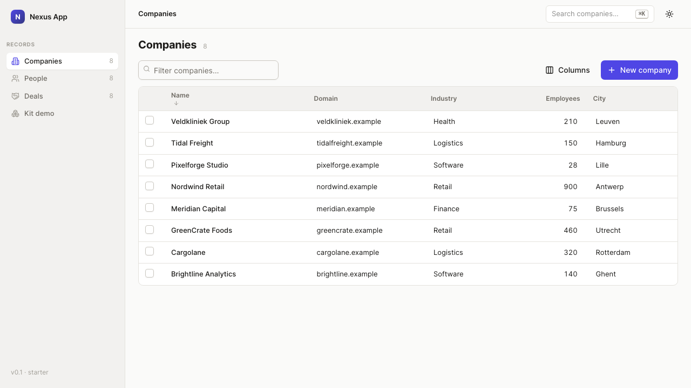
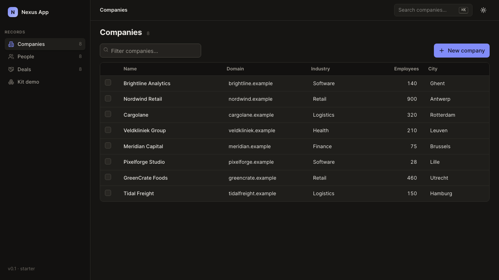
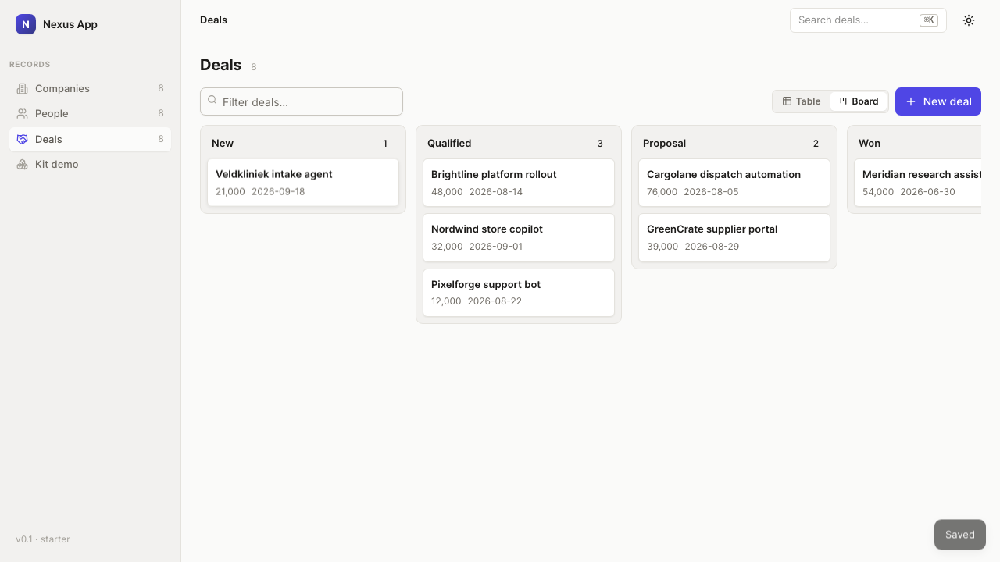

# nexus-app-starter


<details><summary>dark theme · deals board</summary>



</details>

The org's runnable app skeleton for ANY product on Nexus — clone, configure, and you have a working, journey-verified app with the platform wiring in place. The config-driven **record-core** (tables/kanban/record pages from `starter.config.json`) covers record-system classes; everything else is a **custom page** (`src/app/pages.tsx` registry — ordinary React over the full vendored shadcn kit); both hang off the same shell, tokens, data spine, and journeys harness.

## The config IS the app

`starter.config.json` defines the entities, their fields/stages/relations, the views, AND the demo data (`sampleRows`); `CONFIG_PATH=<file>` boots the same build as a different product. Relation fields get pickers (combobox over the target object) and reverse **related lists** on record pages automatically; select fields get filter chips; objects without `sampleRows` are filled by a typed deterministic generator.

The **building-blocks litmus** (`npm run journeys` → `blocks-coverage-litmus`) proves the point continuously: a fixture config with the hardest known topology — two-sided relations, a staged pipeline, dates, scores — must assemble into a working app with zero code changes. When a product class needs a block the fixture can't express, the block gets built in `nexus-ui`/here and the fixture grows to cover it; the fixture is a TEST, never a shipped template.

## Quick start

```bash
npm install --force   # glide-data-grid@6.0.3 pins React <=18; --force keeps modern peer resolution (docs/DEPENDENCIES.md)
npm run sync-ui       # vendor nexus-ui source into src/ui (sibling checkout or $NEXUS_UI_PATH)
npm run build
npm run serve         # zero-dep server on :4000 (+3000/8080) — API + built UI
npm run journeys      # drives the app as a user; stamps journeys/.last-pass + docs/COVERAGE.md
npm run dev           # vite dev server (5173) + API (4000)
```

## What ships

- **Config-driven record-core** (`starter.config.json`): objects → fields → views; tables, kanban, record pages render FROM config (a new entity = a config row).
- **Vendored `nexus-ui`** (`src/ui/`): token canvas + primitives + record-core — the app owns its copy (`npm run sync-ui` to refresh; version in `src/ui/.ui-version`).
- **Zero-dep server** (`server/`): static + `/api` (records, timeline, notes, `app_state` kv — the data-spine SHAPE; swap `store.mjs` for the warehouse client, the UI doesn't change). API JSON is `no-store` — never browser-cached.
- **Nexus wiring** (`src/lib/`): platform client (`api-key` header, server-side only), in-app vendor connect flow (platform credentials, popup + poll), warehouse `app_state` twin stubs; `scripts/register-as-tool.mjs` for archetype 1/2 close-out.
- **Journeys harness** (`journeys/run.mjs`): user-level assertions on VISIBLE outcomes; writes `docs/COVERAGE.md`, updates the manifest's `Last verified`, stamps `journeys/.last-pass` (all-green only). Includes a harness self-check (a bogus selector must fail).
- **Docs contracts** (`docs/`): `SPEC.md` (requirement log — one row per ask) · `DESIGN.md` (the app's design lock; ships as the default canvas) · `feature-manifest.md` · `COVERAGE.md` — the four artifacts the deploy gate reads.
- **Direction boards** (`boards/`): three rendered token directions — serve them, pick one, lock it in `docs/DESIGN.md`.
- **`.nexus-starter`** marker: arms the strict deploy gate for starter-born repos.

## Lifecycle

Clone → rename + edit `starter.config.json` → pick a design direction (`boards/`, lock it in `docs/DESIGN.md`) → build on the record-core → `npm run journeys` green → deploy (`git push` fires the auto-build). Provenance rules: `PROVENANCE.md` (binding).
