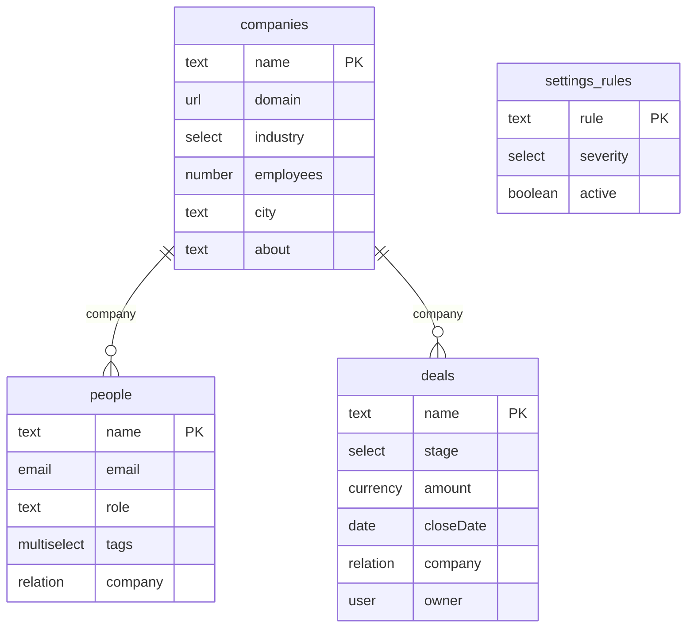

# Data model — derived from `starter.config.json`

Generated by `npm run model`. Do not edit by hand — change the config and regenerate.

The config file is the immutable SEED. With runtime schema editing (the Schema page, FEATURE_SCHEMA), changes overlay it through the command log: this document describes the SEED only. If a human later edits the seed under an existing log, the seed wins on key collisions and historical logged values ride along unvalidated against the new shape.

### Companies (`companies`)
Default view: table

| Field | Type | Notes |
|---|---|---|
| `name` | text | primary |
| `domain` | url |  |
| `industry` | select | options: Software / Retail / Logistics / Health / Finance |
| `employees` | number |  |
| `city` | text |  |
| `about` | text | enrich: Company research |

### People (`people`)
Default view: table

| Field | Type | Notes |
|---|---|---|
| `name` | text | primary |
| `email` | email |  |
| `role` | text |  |
| `tags` | multiselect | options: Champion / Decision maker / Technical / Finance / Ops |
| `company` | relation | → companies |

### Deals (`deals`)
Default view: kanban · stage field: `stage`

| Field | Type | Notes |
|---|---|---|
| `name` | text | primary |
| `stage` | select | options: New / Qualified / Proposal / Won / Lost · stage (board columns) |
| `amount` | currency |  |
| `closeDate` | date |  |
| `company` | relation | → companies |
| `owner` | user |  |

### Settings rules (`settings_rules`)
Default view: table

| Field | Type | Notes |
|---|---|---|
| `rule` | text | primary |
| `severity` | select | options: Critical / Important / Minor |
| `active` | boolean |  |

Users directory: `you`, `Maya Verstraete`, `Jonas Peeters`, `Sofia Marchetti` (drives `user`-type fields).

## App-object options (non-field)
Per object in `starter.config.json`, alongside the field list:
- `hideInNav?: boolean` — hide the object from the sidebar + mobile tab bar (still reachable by URL/relations).
- `recordLayout?: "standard" | "document"` — `standard` = fields + timeline tabs; `document` = a centered Notion-style editor that opens as a wide side-panel.
- `createWizard?: { questions: Q[] }` — a guided-create flow; `Q` is the library Wizard question shape (`{ key, label, kind: text|long|select|list|sources, required?, options? }`). Present → "New <object>" offers guided-vs-blank; each `key` names the field it fills.
- `generate?: { statusField, resultField?, label?, generating?, ready?, titlePlaceholder?, delayMs?, stallAfterMs? }` — a config-driven async-generation action (demo object: `reports`). Present → the object's list gains a "Generate" button that drops a placeholder row (`statusField` = `generating`, default the first status option) and fires the labeled `/api/_mock/generate` writeback; the finished record lands from the warehouse and the SAME row settles (`statusField` = `ready`, default the last option; `resultField` filled). `delayMs` is the mock writeback delay; `stallAfterMs` the "taking longer than usual" threshold. Needs a warehouse (`WAREHOUSE=local` or `bigquery`) for the external-writer catch-up; on the in-memory app the placeholder settles in-process instead.
