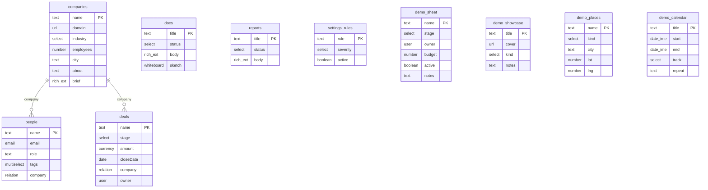

# Data model — derived from `starter.config.json`

Generated by `npm run model`. Do not edit by hand — change the config and regenerate.

The config file is the immutable SEED. With runtime schema editing (the Schema page, FEATURE_SCHEMA), changes overlay it through the command log: this document describes the SEED only. If a human later edits the seed under an existing log, the seed wins on key collisions and historical logged values ride along unvalidated against the new shape.

### Companies (`companies`)
Default view: table

| Field | Type | Notes |
|---|---|---|
| `name` | text | primary |
| `domain` | url |  |
| `industry` | select | options: Software / Retail / Logistics / Health / Finance |
| `employees` | number |  |
| `city` | text |  |
| `about` | text | enrich: Company research |
| `brief` | richText |  |

### People (`people`)
Default view: table

| Field | Type | Notes |
|---|---|---|
| `name` | text | primary |
| `email` | email |  |
| `role` | text |  |
| `tags` | multiselect | options: Champion / Decision maker / Technical / Finance / Ops |
| `company` | relation | → companies |

### Deals (`deals`)
Default view: kanban · stage field: `stage`

| Field | Type | Notes |
|---|---|---|
| `name` | text | primary |
| `stage` | select | options: [object Object] / [object Object] / [object Object] / [object Object] / [object Object] · stage (board columns) |
| `amount` | currency |  |
| `closeDate` | date |  |
| `company` | relation | → companies |
| `owner` | user |  |

### Docs (`docs`)
Default view: table

| Field | Type | Notes |
|---|---|---|
| `title` | text | primary |
| `status` | select | options: Draft / In review / Approved / Published |
| `body` | richText |  |
| `sketch` | whiteboard |  |

### Reports (`reports`)
Default view: table

| Field | Type | Notes |
|---|---|---|
| `title` | text | primary |
| `status` | select | options: Generating / Ready |
| `body` | richText |  |

### Settings rules (`settings_rules`)
Default view: table

| Field | Type | Notes |
|---|---|---|
| `rule` | text | primary |
| `severity` | select | options: Critical / Important / Minor |
| `active` | boolean |  |

### Sheet demo (`demo_sheet`)
Default view: grid

| Field | Type | Notes |
|---|---|---|
| `name` | text | primary |
| `stage` | select | options: [object Object] / [object Object] / [object Object] / [object Object] / [object Object] |
| `owner` | user |  |
| `budget` | number |  |
| `active` | boolean |  |
| `notes` | text |  |

### Showcase (`demo_showcase`)
Default view: gallery

| Field | Type | Notes |
|---|---|---|
| `title` | text | primary |
| `cover` | url |  |
| `kind` | select | options: [object Object] / [object Object] / [object Object] |
| `notes` | text |  |

### Places (`demo_places`)
Default view: map

| Field | Type | Notes |
|---|---|---|
| `name` | text | primary |
| `kind` | select | options: [object Object] / [object Object] / [object Object] |
| `city` | text |  |
| `lat` | number |  |
| `lng` | number |  |

### Sessions (`demo_calendar`)
Default view: calendar

| Field | Type | Notes |
|---|---|---|
| `title` | text | primary |
| `start` | dateTime |  |
| `end` | dateTime |  |
| `track` | select | options: [object Object] / [object Object] / [object Object] |
| `repeat` | text |  |

Users directory: `you`, `Maya Verstraete`, `Jonas Peeters`, `Sofia Marchetti` (drives `user`-type fields).

<!-- hand-maintained below -->

## Field value shapes (beyond primitives)
- `whiteboard` — `{ "elements": ExcalidrawElement[] }` (elements only; a stored `appState` key is tolerated and ignored — the canvas scrolls to content on every mount). Elements are excalidraw's serialized-element objects (drawn in the editor, never hand-written); the server validates `elements` is an array, timeline events log `canvas · N elements`, and free-text search skips the field. Full recipe: docs/RECIPES.md "Add a whiteboard (canvas) field to an object".

## App-object options (non-field)
Per object in `starter.config.json`, alongside the field list:
- `hideInNav?: boolean` — hide the object from the sidebar + mobile tab bar (still reachable by URL/relations).
- `recordLayout?: "standard" | "document"` — `standard` = fields + timeline tabs; `document` = a centered Notion-style editor that opens as a wide side-panel.
- `createWizard?: { questions: Q[] }` — a guided-create flow; `Q` is the library Wizard question shape (`{ key, label, kind: text|long|select|list|sources, required?, options? }`). Present → "New <object>" offers guided-vs-blank; each `key` names the field it fills.
- `generate?: { statusField, resultField?, label?, generating?, ready?, titlePlaceholder?, delayMs?, stallAfterMs? }` — a config-driven async-generation action (demo object: `reports`). Present → the object's list gains a "Generate" button that drops a placeholder row (`statusField` = `generating`, default the first status option) and fires the labeled `/api/_mock/generate` writeback; the finished record lands from the warehouse and the SAME row settles (`statusField` = `ready`, default the last option; `resultField` filled). `delayMs` is the mock writeback delay; `stallAfterMs` the "taking longer than usual" threshold. Needs a warehouse (`WAREHOUSE=local` or `bigquery`) for the external-writer catch-up; on the in-memory app the placeholder settles in-process instead.
- `views?: { type, …config }[]` — the object's view tabs, in order. `type` picks an installed view definition (`table` | `kanban` | `chart` | `flow` | `calendar` | `gallery` | `form` | `map` built in; adding one: CONTRIBUTING-AGENTS "Adding a view type"); the other keys are that type's config (kanban/chart take `groupField`, a select/user field key; chart takes `measure`, `"count"` or a number/currency/money field key; flow takes `relationField`, a relation field key drawing the edges — self-relations draw record→child edges, cross-object relations draw labeled target hubs — and `labelField`, the card title field, default primary; recipe: docs/RECIPES.md "Add a flow (node-graph) view to an object"). The `calendar` type takes `startDateField` (required, a date/dateTime field key, defaulting to the first one), `endDateField` (optional; events become resizable spans, stored end dates stay inclusive), `titleField` (defaults to the primary) and `colorField` (a select field key; events take its option palette); its view state persists `calMode` ("month" | "week") and `calDate` (the visible anchor). Omitted → derived set: every object gets the table, plus Board + Chart when a select/user field exists. `defaultView` names the initially-active tab. A runtime pick in the Columns/group-by/measure/rollup/via menus overrides the config per user (persisted per object; saved views capture it). An entry naming an uninstalled or invalid type renders as an inline "not installed" chip in place of the view, never a crash.
- `views[]` entry, `type: "gallery"` — `coverField?` (a url/links/array field; the first image-like value is the cover; missing/broken → initials placeholder; default: the first url field) · `coverFit?: "cover" | "contain"` (default cover) · `titleField?` (default: the primary field) · `cardFields?` (ordered field keys rendered on each card through the field registry; supersedes `metaFields`, which stays honored) · `groupField?` (a select/user field — cards split into collapsible sections; also a toolbar control, sharing the board's `groupBy` so a group choice carries across views) · `sortField?` + `sortDir?: "asc" | "desc"` (also a toolbar control) · `cardSize?: "s" | "m" | "l"` · `cardClick?: "peek" | "open"`. Card selection wires the host bulk bar; rendering is windowed per section for large objects.
- `views[]` entry, `type: "form"` — `fields?` (field keys to render, in order; default: every form-editable field — `json` and many-relations excluded) · `sections?` (`[{label, fields[]}]` — labeled field groups; supersedes `fields`) · `requiredOverrides?` (`{key: true|false}` over the primary-only default) · `requiredWhen?` (`{key: {field, equals}}` — a field becomes required when its trigger field equals a value) · `submitLabel?` · `successMode?: "another" | "view"`. Submits through the object's create path; a failed submit shows a jump-to-field error summary above the inline errors; server messages map back onto their field.
