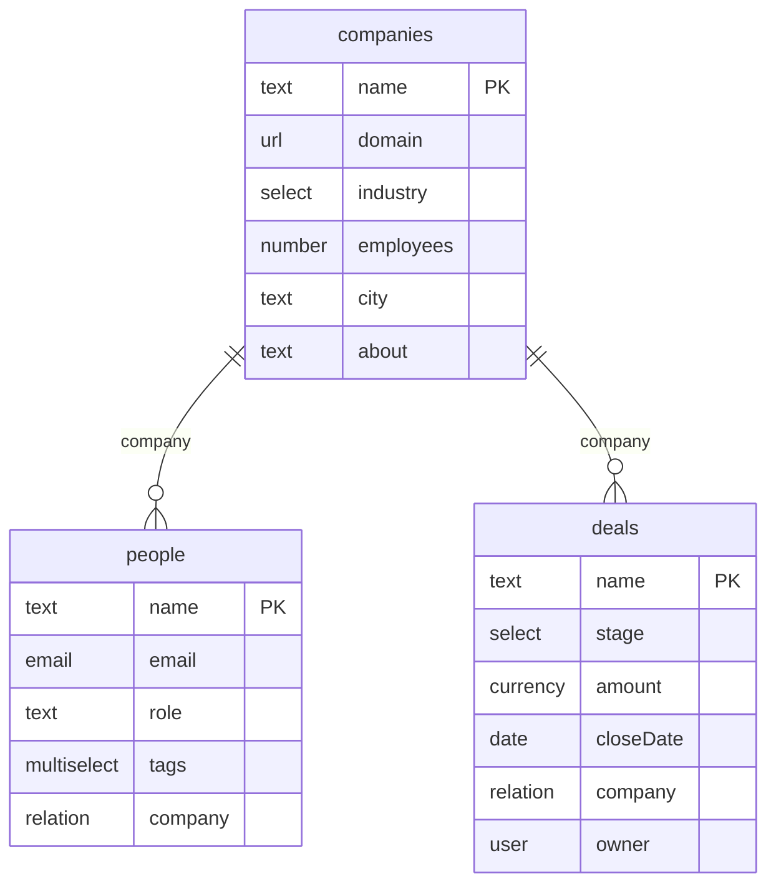

# Data model — derived from `starter.config.json`

Generated by `npm run model`. Do not edit by hand — change the config and regenerate.

### Companies (`companies`)
Default view: table

| Field | Type | Notes |
|---|---|---|
| `name` | text | primary |
| `domain` | url |  |
| `industry` | select | options: Software / Retail / Logistics / Health / Finance |
| `employees` | number |  |
| `city` | text |  |
| `about` | text | enrich: Company research |

### People (`people`)
Default view: table

| Field | Type | Notes |
|---|---|---|
| `name` | text | primary |
| `email` | email |  |
| `role` | text |  |
| `tags` | multiselect | options: Champion / Decision maker / Technical / Finance / Ops |
| `company` | relation | → companies |

### Deals (`deals`)
Default view: kanban · stage field: `stage`

| Field | Type | Notes |
|---|---|---|
| `name` | text | primary |
| `stage` | select | options: New / Qualified / Proposal / Won / Lost · stage (board columns) |
| `amount` | currency |  |
| `closeDate` | date |  |
| `company` | relation | → companies |
| `owner` | user |  |

Users directory: `you`, `Maya Verstraete`, `Jonas Peeters`, `Sofia Marchetti` (drives `user`-type fields).

## Record lifecycle

`DELETE /api/objects/:key/:id` is a SOFT delete — the row gains `_deletedAt` and disappears from lists, gets, search, and boards while keeping its data and timeline. `GET /api/objects/:key/trash` lists trashed rows; `POST …/:id/restore` clears the stamp; `DELETE …/:id/destroy` removes the row, its timeline, and its files permanently. Merge (`POST /api/objects/:key/merge`) folds duplicates into a chosen winner and trashes the losers. Webhook events: `<key>.deleted` (trash), `<key>.restored`, `<key>.destroyed`.
