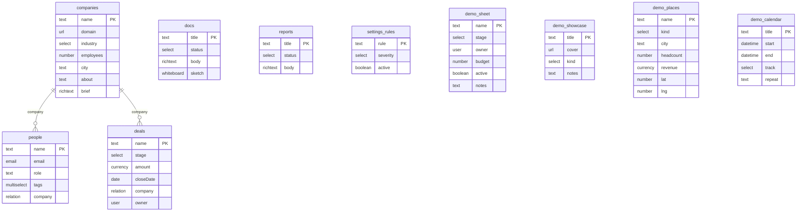

# Data model — derived from `starter.config.json`

Generated by `npm run model`. Do not edit by hand — change the config and regenerate.

The config file is the immutable SEED. With runtime schema editing (the Schema page, FEATURE_SCHEMA), changes overlay it through the command log: this document describes the SEED only. If a human later edits the seed under an existing log, the seed wins on key collisions and historical logged values ride along unvalidated against the new shape.

### Companies (`companies`)
Default view: table

| Field | Type | Notes |
|---|---|---|
| `name` | text | primary |
| `domain` | url |  |
| `industry` | select | options: Software / Retail / Logistics / Health / Finance |
| `employees` | number |  |
| `city` | text |  |
| `about` | text | enrich: Company research |
| `brief` | richText |  |

### People (`people`)
Default view: table

| Field | Type | Notes |
|---|---|---|
| `name` | text | primary |
| `email` | email |  |
| `role` | text |  |
| `tags` | multiselect | options: Champion / Decision maker / Technical / Finance / Ops |
| `company` | relation | → companies |

### Deals (`deals`)
Default view: kanban · stage field: `stage`

| Field | Type | Notes |
|---|---|---|
| `name` | text | primary |
| `stage` | select | options: New / Qualified / Proposal / Won / Lost · stage (board columns) |
| `amount` | currency |  |
| `closeDate` | date |  |
| `company` | relation | → companies |
| `owner` | user |  |

### Docs (`docs`)
Default view: table

| Field | Type | Notes |
|---|---|---|
| `title` | text | primary |
| `status` | select | options: Draft / In review / Approved / Published |
| `body` | richText |  |
| `sketch` | whiteboard |  |

### Reports (`reports`)
Default view: table

| Field | Type | Notes |
|---|---|---|
| `title` | text | primary |
| `status` | select | options: Generating / Ready |
| `body` | richText |  |

### Settings rules (`settings_rules`)
Default view: table

| Field | Type | Notes |
|---|---|---|
| `rule` | text | primary |
| `severity` | select | options: Critical / Important / Minor |
| `active` | boolean |  |

### Sheet demo (`demo_sheet`)
Default view: grid

| Field | Type | Notes |
|---|---|---|
| `name` | text | primary |
| `stage` | select | options: Backlog / Scoping / Building / Review / Shipped |
| `owner` | user |  |
| `budget` | number |  |
| `active` | boolean |  |
| `notes` | text |  |

### Showcase (`demo_showcase`)
Default view: gallery

| Field | Type | Notes |
|---|---|---|
| `title` | text | primary |
| `cover` | url |  |
| `kind` | select | options: Photo / Sketch / Chart |
| `notes` | text |  |

### Places (`demo_places`)
Default view: map

| Field | Type | Notes |
|---|---|---|
| `name` | text | primary |
| `kind` | select | options: Office / Warehouse / Store / Customer / Partner / Site |
| `city` | text |  |
| `headcount` | number |  |
| `revenue` | currency |  |
| `lat` | number |  |
| `lng` | number |  |

### Sessions (`demo_calendar`)
Default view: calendar

| Field | Type | Notes |
|---|---|---|
| `title` | text | primary |
| `start` | dateTime |  |
| `end` | dateTime |  |
| `track` | select | options: Design / Build / Review |
| `repeat` | text |  |

Users directory: `you`, `Maya Verstraete`, `Jonas Peeters`, `Sofia Marchetti` (drives `user`-type fields).

<!-- hand-maintained below -->

## Field value shapes (beyond primitives)
- `whiteboard` — `{ "elements": ExcalidrawElement[] }` (elements only; a stored `appState` key is tolerated and ignored — the canvas scrolls to content on every mount). Elements are excalidraw's serialized-element objects (drawn in the editor, never hand-written); the server validates `elements` is an array, timeline events log `canvas · N elements`, and free-text search skips the field. Full recipe: docs/RECIPES.md "Add a whiteboard (canvas) field to an object".

## App-object options (non-field)

Per object in `starter.config.json`, alongside the field list: `hideInNav` · `recordLayout`
· `openIn` · `columns` · `contextFields` · `stageField` · `pipelineField` · `teamScoped` ·
`permissions` · `createWizard` · `generate` · `views` · `sampleRows` / `seedCount`.

**The complete reference — every top-level key, every object key, every field key and
flag, and each view type's own options — is `docs/CONFIG.md`.** It is the single place
config surface is documented; this file stays the generated view of the CURRENT config.
